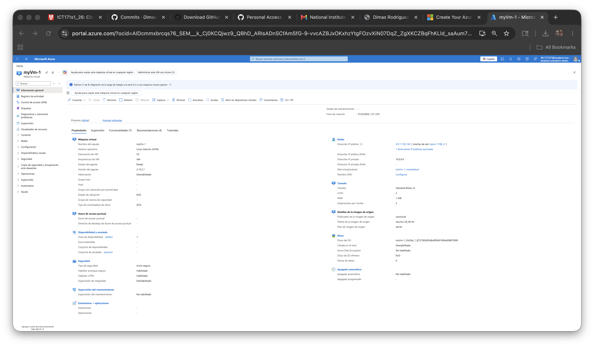
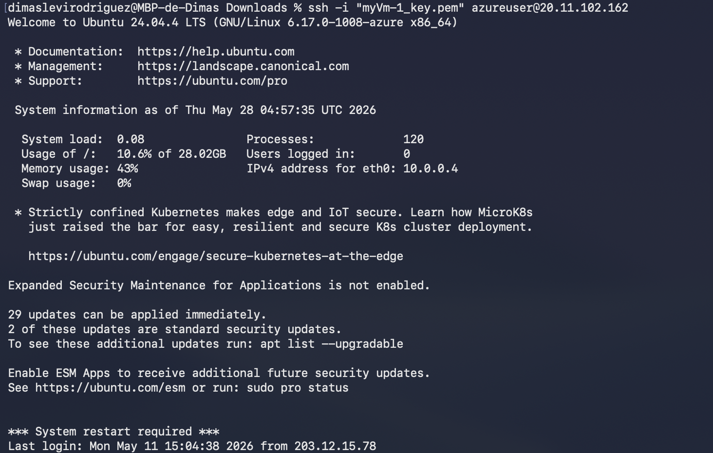
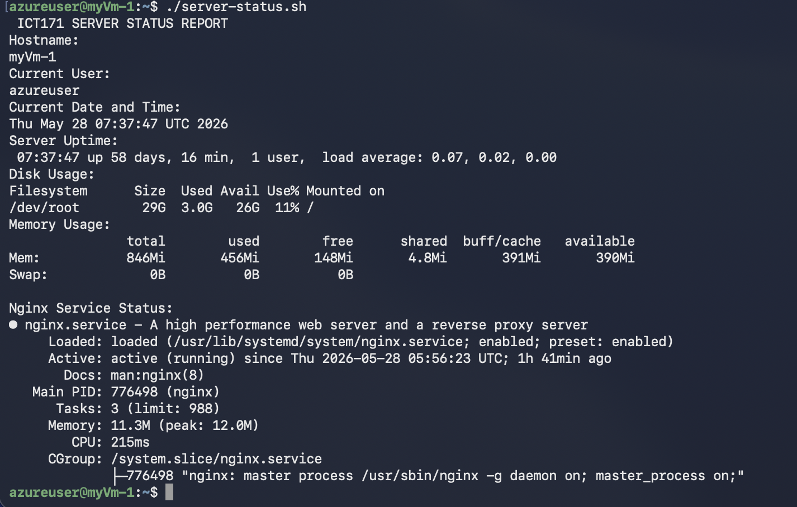
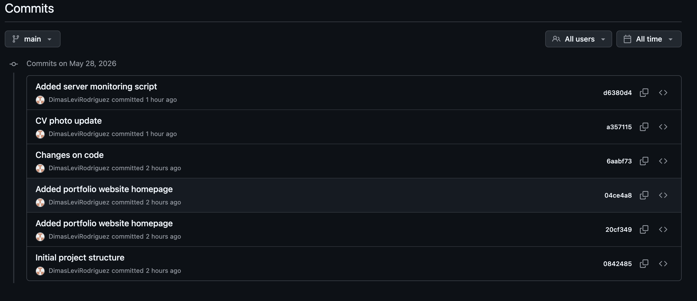

# ICT171 Cloud Server Project

## Student Information

- **Name:** Dimas Rodriguez  
- **Student ID:** 36172107  
- **Unit:** ICT171 – Introduction to Server Environments and Architectures  
- **University:** Murdoch University  
- **Project Type:** Cloud Hosted Portfolio Website  

---

# Project Overview

This project involved the deployment and management of a cloud-hosted Linux web server using Microsoft Azure.  

The purpose of the project was to design, configure, secure, and deploy a personal portfolio website hosted on an Ubuntu Linux virtual machine running Nginx.  

The project demonstrates practical cloud computing skills including:

- Linux server administration
- Remote SSH access
- Website deployment
- DNS configuration
- HTTPS/SSL implementation
- Bash scripting
- GitHub version control
- Cloud infrastructure management

The website was developed using HTML and CSS and deployed publicly using a custom domain with HTTPS enabled.

---

# Technologies Used

- Microsoft Azure
- Ubuntu Linux 24.04 LTS
- Nginx Web Server
- HTML5
- CSS3
- Git & GitHub
- Bash Scripting
- SSH
- SSL/TLS Certificates
- DNS Configuration

---

# Live Website

🌐 https://dimasrodriguez.site

---

# GitHub Repository

🔗 https://github.com/DimasLeviRodriguez/ict171-cloud-server-project

---

# Features Implemented

## Cloud Infrastructure
- Microsoft Azure virtual machine deployment
- Ubuntu Linux server configuration
- Public IP networking
- DNS setup

## Website Hosting
- Nginx web server installation
- Portfolio website deployment
- Public website accessibility

## Security
- HTTPS enabled using SSL/TLS
- Secure remote SSH administration

## Scripting
A custom Bash monitoring script was created to display:
- hostname
- uptime
- memory usage
- disk usage
- nginx service status

## Version Control
- Git repository initialization
- Multiple commits during development
- GitHub remote repository integration

---

# Screenshots

## Azure Virtual Machine Dashboard



---

## SSH Remote Access



---

## HTTPS Enabled Website


---

## Portfolio Website


---

## Server Monitoring Script Output



---

## GitHub Commit History



---

# Bash Monitoring Script

The server monitoring script was created to provide useful system information directly from the Linux server.

The script displays:
- hostname
- current user
- current time
- uptime
- disk usage
- memory usage
- nginx service status

Example execution:

```bash
./server-status.sh
